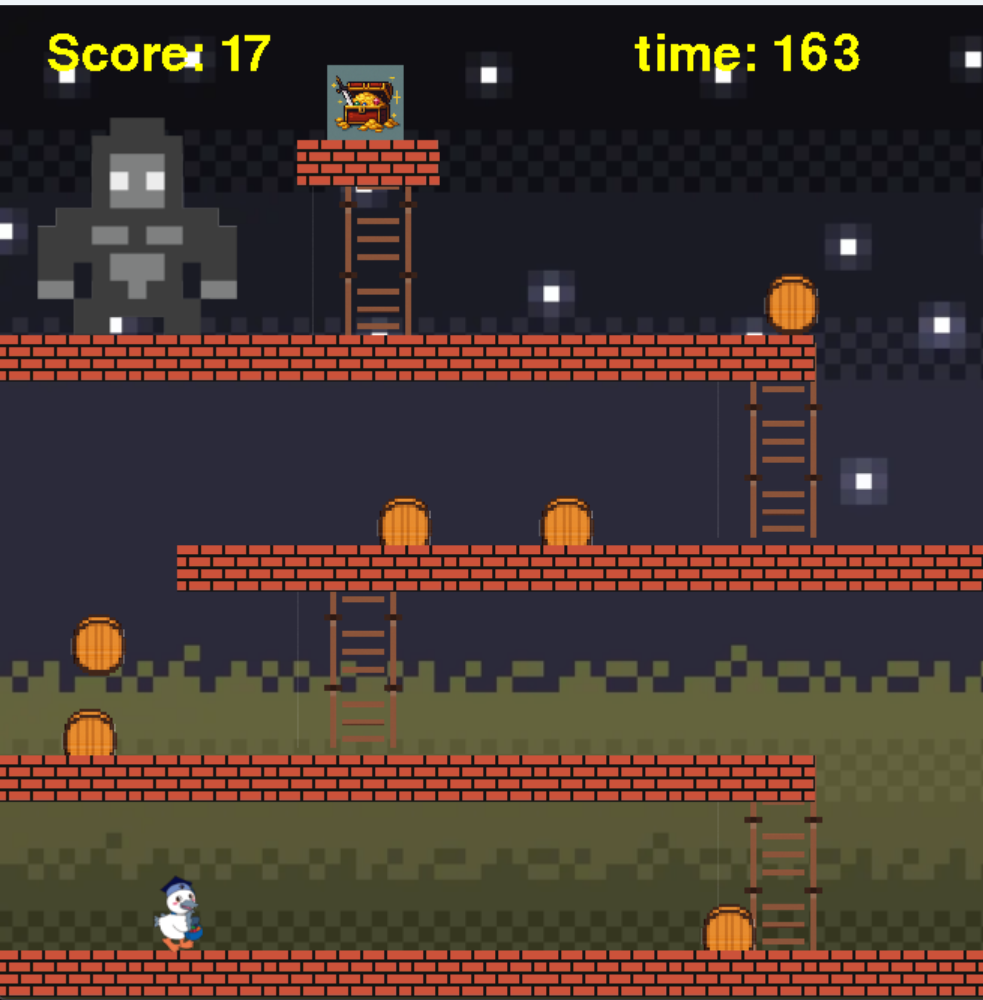

# ドンキーコンドル

## 実行環境の必要条件
* python >= 3.10
* pygame >= 2.1

## ゲームの概要
* ゴリラが投げてくる樽をよけながらお宝を目指す

## ゲームの遊び方
* 矢印キーでこうかとんを動かす
* 頂上にあるお宝を取るとクリア
* 転がってくる樽を避ける
* 梯子の場所で上やじるしを押すと上昇

## ゲームの実装
### 共通基本機能
* 背景画像と主人公キャラクター、敵の描画
* キャラクターの動き

### 分担追加機能
* スコアの表示（りく） :時間が経過するごとにスコア上昇
* 梯子をのぼる判定（りゅうと） :梯子の上で上やじるしを押したら上昇
* ブロック判定、重力、タイマー（たくみ） :ブロックごとの床判定機能。床がなくなった時に落ちる機能。残り時間を表示する機能。
* 敵の攻撃（樽）の描写と判定（ふうた）：敵のゴリラとそのゴリラが樽を出して攻撃してくる機能。
* ゲームクリア、オーバーの表示（るい） :ゲームオーバー、ゲームクリアしたときに表示する機能。

### ToDo
* BGM
* 樽を避けたときにスコアアップ
* ゴリラのモーション

### メモ
* 重力を設定する過程でgravityの値とjump_highの値を変えた
